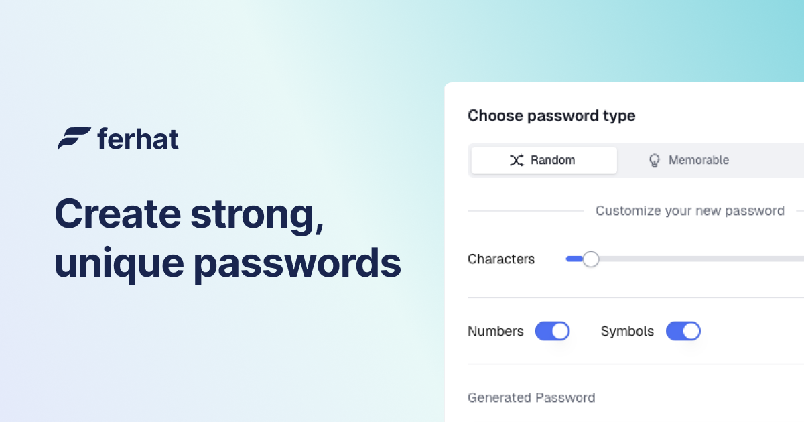

<h1 align="center" style="border-bottom: none">
    Password Generator
</h1>

A versatile password generator application built with **Next.js**. This app allows you to generate strong, memorable, and numeric passwords with various customization options. It provides three different types of password generation:

- **Random**: Generates passwords (8-100 characters) with optional numbers and symbols.
- **Memorable**: Generates text-based passwords (3-15 characters) with options for capitalization and full words.
- **PIN**: Generates numeric passwords (3-12 characters).

## Features

- Generate passwords with different lengths (8-100 characters).
- Choose to include numbers and special symbols for more complex passwords.
- Create memorable passwords with optional capitalization and words.
- Generate numeric PINs with variable lengths (3-12 characters).
- Easy-to-use interface with buttons to copy and refresh passwords.
